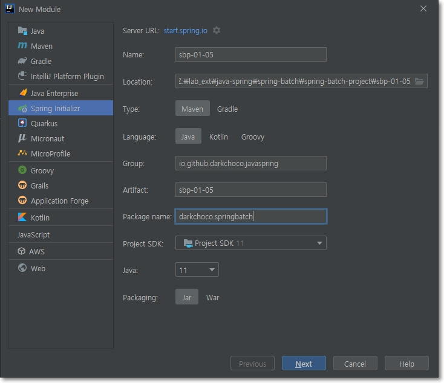
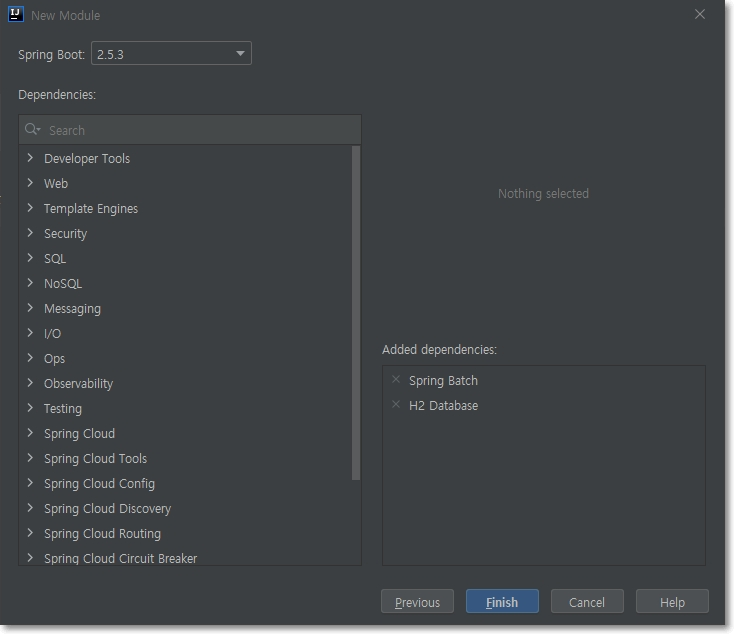

= Spring Batch Project
:toc:

{sp}+

== Project setup
=== spring-batch-project
``spring-batch-project``를 기본으로, 진행할 프로젝트들은 그 아래 Module로 등록한다.

NOTE: ``spring-batch-project``는 ``<packaging>pom</packaging>``으로 구성해야 한다.

아래는 Windows ``cmd``에서 실행한 내역이다.
[source,bash]
----
mvn archetype:generate ^
-DgroupId=io.github.darkchoco.javaspring ^
-DartifactId=spring-batch-project ^
-DarchetypeArtifactId=maven-archetype-quickstart ^
-DinteractiveMode=false
----

=== sbp-XX-XX (Module)
하위 Module의 ``pom.xml``에서 아래 내용을 주목한다. +
즉 ``spring-batch-project``를 ``parent``로 하지 않고 ``spring-boot-starter-parent``를 지정했다. (이게 맞을 듯)
[source, xml]
----
    ...
    <parent>
        <groupId>org.springframework.boot</groupId>
        <artifactId>spring-boot-starter-parent</artifactId>
        <version>2.5.3</version>
        <relativePath/> <!-- lookup parent from repository -->
    </parent>
    <groupId>io.github.darkchoco.javaspring</groupId>
    <artifactId>sbp-01-05</artifactId>
    <version>0.0.1-SNAPSHOT</version>
    <name>sbp-01-05</name>
    <description>Demo project for Spring Boot</description>
    ...
----

아래는 IntelliJ를 이용하여 Module을 생성하는 화면이다.

== 2. Building Batch Jobs
=== Job parameters
parameter가 2개 이상 있을 경우 아래와 같이 quote를 사용한다.
[source, bash]
----
Z:\lab_ext\java-spring\spring-batch\spring-batch-project\sbp-02-01\target>java -jar .\sbp-02-01-0.0.1-SNAPSHOT.jar "item=shoes" "run.date(date)=2021/08/11"
----